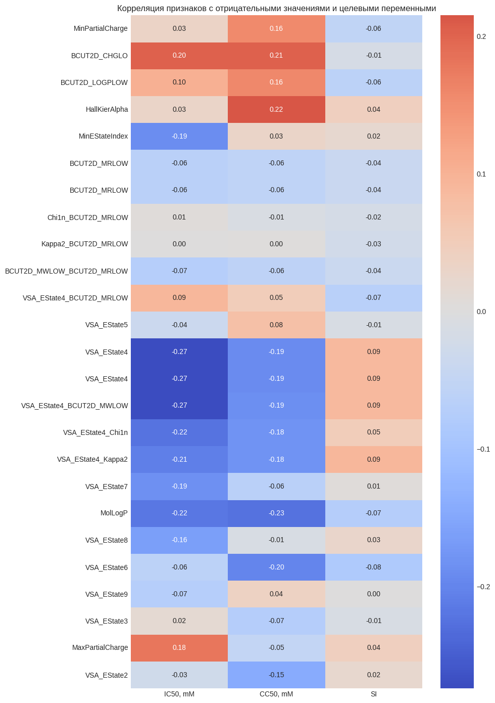

# Health_Tech_CourseWork_2025

# 🧪 ML-модели для предсказания биологических свойств химических соединений

## 📌 Описание проекта

Цель курсовой работы — построение моделей машинного обучения для прогнозирования ключевых биологических показателей химических соединений (IC₅₀, CC₅₀, SI), а также проведение классификации по заданным условиям. Работа направлена на поддержку доклинических исследований в фармацевтике.

---

## 📂 Структура репозитория

| №  | Название файла               | Назначение |
|----|------------------------------|------------|
| 1  | `eda_data_eng.ipynb`         | Исследовательский анализ данных (EDA) и предварительная обработка (Data Engineering) |
| 2  | `reg_ic50.ipynb`             | Регрессия для IC₅₀ |
| 3  | `reg_cc50.ipynb`             | Регрессия для CC₅₀ |
| 4  | `reg_si.ipynb`               | Регрессия для SI |
| 5  | `clf_ic50_median.ipynb`      | Классификация: IC₅₀ > медианы |
| 6  | `clf_cc50_median.ipynb`      | Классификация: CC₅₀ > медианы |
| 7  | `clf_si_median.ipynb`        | Классификация: SI > медианы |
| 8  | `clf_si_8.ipynb`             | Классификация: SI > 8 |
| 9  | `report.pdf` или `report.docx` | Финальный аналитический отчёт с выводами, графиками и сравнением моделей |

---

## 🔧 Используемые технологии

- Python 3.10
- Pandas, NumPy
- Scikit-learn
- XGBoost, LightGBM
- Matplotlib, Seaborn

---

## 📊 Метрики и сравнение

Для оценки качества моделей использовались:

- Регрессия: MAE, RMSE, R²
- Классификация: Accuracy, Precision, Recall, F1-score, ROC-AUC

## 📊 Feature Engineering: анализ признаков с отрицательными значениями

В ходе анализа были выявлены числовые признаки, содержащие отрицательные значения. Поскольку задача связана с предсказанием биологических свойств химических соединений, было принято решение **не удалять строки с такими значениями**, а проверить **информативность самих признаков**.

Для этого была рассчитана корреляция каждого признака с тремя целевыми переменными: `IC50, mM`, `CC50, mM` и `SI`.

### 🔍 Выводы по результатам анализа

#### ✅ Оставлены (информативные признаки):
- `VSA_EState4`
- `MolLogP`
- `VSA_EState6`
- `VSA_EState4_Chi1n`
- `VSA_EState4_Kappa2`
- `VSA_EState4_BCUT2D_MWLOW`
- `VSA_EState7`

Эти признаки показали заметную корреляцию с одной или несколькими целевыми переменными и были включены в финальное множество признаков.

#### ❌ Исключены (низкая корреляция, шум):
- `Chi1n_BCUT2D_MRLOW`
- `Kappa2_BCUT2D_MRLOW`
- `VSA_EState5`
- `VSA_EState3`
- `VSA_EState2`
- `MaxPartialCharge`

Данные признаки не продемонстрировали значимой связи с таргетами и были удалены как неинформативные.

### 🧠 Комментарий

Такой подход позволяет сохранить интерпретируемость модели и одновременно избежать включения шумовых признаков, что важно для задач регрессии и классификации в химии и биоинформатике.

---

## 🧠 Автор

Анна Перова  
Магистратура МИФИ · Машинное обучение и анализ данных  
